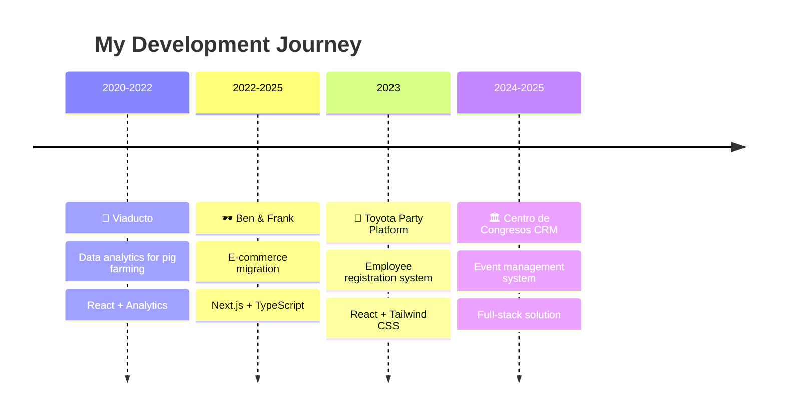

# 👨‍💻 Jorge Rojas - Frontend Engineer

```typescript
const jorge: Developer = {
  location: "🇪🇸 Spain (originally from 🇲🇽 Mexico)",
  role: "Frontend Engineer",
  experience: "5+ years",
  passion: ["Clean Code", "User Experience", "Tacos al Pastor"],
  currentlyWorkingOn: "Modern web applications with React & TypeScript",
  funFact: "I debug faster after morning coffee ☕"
};

console.log(`Hello World! I'm ${jorge.role} from ${jorge.location}`);
```

<div align="center">

**Building digital experiences that users actually enjoy using**

[](https://jorggerojas.dev)
[](https://linkedin.com/in/jorggerojas)
[](mailto:jorge.rojas.arcos@gmail.com)
[](https://instagram.com/jorggerojas)

</div>

---

## 📚 The Story So Far

**From Querétaro to Santiago to Spain** - My journey as a developer has been as diverse as my tech stack. Started with curiosity about how websites work, evolved into a passion for creating seamless user experiences, and now I lead teams building e-commerce platforms that real people use every day.

**What drives me?** The moment when a user tries your app and everything just *clicks*. That perfect intersection of beautiful design, performant code, and intuitive UX.

### ⚡ Quick Stats

- 🚀 **Projects shipped:** 15+ production applications
- 🏢 **Teams led:** 3 multidisciplinary squads
- ☕ **Coffee consumed while coding:** Too many to count
- 🎓 **Universities:** UAQ (Software Engineering) + USC (Exchange)
- 🗣️ **Languages:** Spanish (native), English (professional), Galician (B1)

---

## 🚀 Code Adventures

> *Each project teaches you something new. Here are some that shaped my journey...*



### 🌟 Project Highlights

**🕶️ [Ben & Frank & Bombavista](https://www.benandfrank.com/)**
> *"From legacy to cutting-edge"*

- Migrated monolithic e-commerce to modern React ecosystem
- Built design system that reduced development time by 30%
- **Stack:** Next.js, TypeScript, Tailwind CSS, Performance-first

**🚗 Toyota December Party Portal**
> *"Making corporate events fun again"*

- Streamlined employee registration process (75% time reduction)
- Boosted participation by 50% with intuitive UX
- **Stack:** React, Tailwind CSS, Event Management

**📊 [Porkscore](https://porkscore.com/)**
> *"My first real-world impact"*

- Analytics platform for agricultural KPIs
- Reduced report generation from hours to minutes
- **Stack:** React, Data Visualization, Farm Analytics

---

## 🧰 My Digital Toolbox

```javascript
const mySkills = {
  frontend: {
    languages: ["TypeScript", "JavaScript", "HTML5", "CSS3"],
    frameworks: ["React", "Next.js", "Astro"],
    styling: ["Tailwind CSS", "CSS Modules", "Styled Components"],
    testing: ["Jest", "React Testing Library", "Vitest"]
  },
  backend: {
    runtime: ["Node.js", "Bun"],
    databases: ["MongoDB", "MySQL", "PostgreSQL"],
    tools: ["Express", "Prisma", "REST APIs"],
    languages: ["TypeScript", "JavaScript", "Python"]
  },
  workflow: {
    versionControl: ["Git", "GitHub", "GitLab"],
    bundlers: ["Vite", "Webpack", "Turbopack"],
    design: ["Figma", "Adobe XD"],
    deployment: ["Vercel", "Netlify", "Docker", "GitHub Actions"]
  },
  currentlyExploring: ["React Native", "AI/ML Integration"],
  alwaysLearning: true
};

console.log("Ready to build something amazing! 🚀");
```

## 📊 GitHub Analytics

<div align="center">


</div>

---

## 🌍 Multilingual Developer

```yaml
languages:
  spanish:
    level: "Native 🇲🇽"
    use_case: "Dreaming and debugging"
  english:
    level: "Professional (C1) 🇺🇸"
    use_case: "Code reviews and documentation"
  galician:
    level: "Intermediate (B1) 🇪🇸"
    use_case: "Current home adventures"
    
cultural_background:
  - "Mexican creativity meets Spanish innovation"
  - "Querétaro → Santiago de Compostela → Current Spain adventures"
  - "Building bridges through code, one component at a time"
```

---

## 🎯 What's Next?

**2025 Roadmap:**

- [ ] 🤖 **Deep dive into AI-assisted development** - Exploring GitHub Copilot workflows
- [ ] 📱 **React Native mastery** - Time to conquer mobile development
- [ ] 🎨 **Design system evangelism** - Building reusable component libraries
- [ ] 📝 **Technical writing** - Starting a developer blog with Astro

---

## 🎭 Developer Personality

```json
{
  "workingStyle": "Night person 🌙 (peak productivity at 9 PM)",
  "debuggingStrategy": "Console.log detective 🕵️",
  "codeStyle": "Clean, readable, and well-commented",
  "teamRole": "The one who asks 'but what about mobile users?'",
  "superpower": "Turning complex problems into simple solutions",
  "weakness": "Getting too excited about new CSS features",
  "motivatedBy": "User feedback and performance metrics",
  "codeReviewStyle": "Constructive with emoji reactions 😊",
 
}
```

### 🏃‍♂️ Life Beyond Code

- **☕ Coffee Lover:** Always on the hunt for the perfect brew
- **🍳 Cooking:** Mexican cuisine with Spanish twists
- **✈️ Travel:** Collecting passport stamps and food inspiration

---

## 💬 Let's Build Something Together

```typescript
interface Collaboration {
  openTo: string[];
  interests: string[];
  contactMethods: ContactInfo;
}

const collaboration: Collaboration = {
  openTo: [
    "Frontend development projects",
    "Open source contributions",
    "Tech mentoring and knowledge sharing", 
    "Coffee chats about code (virtual or in-person)"
  ],
  interests: [
    "React/Next.js applications",
    "Design system development", 
    "Performance optimization",
    "User experience improvements"
  ],
  contactMethods: {
    email: "jorge.rojas.arcos@gmail.com",
    website: "jorggerojas.dev",
    linkedin: "/in/jorggerojas",
    responseTime: "Usually within 24 hours ⚡"
  }
};

// Let's connect!
console.log("Ready to collaborate? Drop me a message! 🚀");
```

### 🌟 Final Thoughts

> *"The best code is not just functional—it's empathetic. It understands the user, respects the developer who comes after you, and solves real problems."*

**Thanks for stopping by!** If you've made it this far, you're probably the kind of person I'd love to work with. Whether you're here for potential collaboration, just browsing, or looking for taco recommendations in Spain, feel free to reach out.

---

<div align="center">

**Made with ❤️ and lots of ☕ by Jorge Rojas**

*Last updated: October 2025 | Built with Markdown & love for clean code*

⭐ **Like what you see?** Star some repos and let's connect!

</div>
